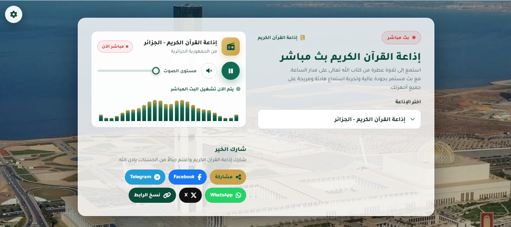
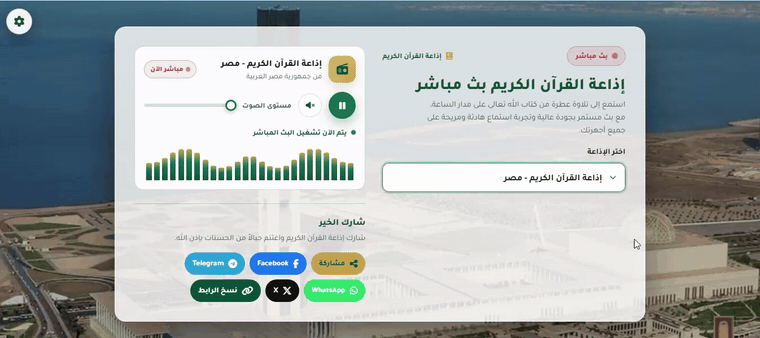

# إذاعة القرآن الكريم — قالب بث مباشر (Blogger + ويب)

<div dir="rtl">

صفحة ويب عربية واحدة (RTL) لتشغيل بث مباشر لإذاعات القرآن الكريم، موزعة بصيغتين متكاملتين:

| الصيغة | الملف | الاستخدام |
|---|---|---|
| قالب Blogger | `public/holy-quran-radio-blogger-template.xml` | تثبيتها كقالب مدونة على منصة Blogger |
| صفحة ويب ثابتة | `public/preview.html` | نسخة معاينة مستقلة تعمل في أي استضافة ثابتة |

**النسخة الحية (Blogger):** <https://holy-quran-radio1.blogspot.com>

<div align="center">
  
  
  <p>🎬 <a href="docs/quran-radio.mp4">فيديو العرض التوضيحي بجودة كاملة (اضغط للمشاهدة)</a></p>
</div>

---

## المزايا

- بث مباشر لثلاث إذاعات قرآنية (السعودية، الجزائر، مصر) مع تبديل فوري
- تحكم كامل من شاشة القفل عبر MediaSession API (تشغيل/إيقاف/المحطة التالية)
- حفظ التفضيلات تلقائيًا: المحطة، مستوى الصوت، الخلفية
- خلفية قابلة للتخصيص: تدرج افتراضي، صورة أو فيديو (بالرفع من الجهاز أو برابط) — الملفات المرفوعة تُحفظ في متصفح جهازك (IndexedDB) وتُستعاد عند العودة
- إعادة اتصال تلقائية تصاعدية عند انقطاع البث (حتى 6 محاولات)
- أزرار مشاركة: نظام التشغيل، فيسبوك، ماسنجر، تيليجرام، واتساب، X، ونسخ الرابط
- دعم PWA: قابل للتثبيت كتطبيق على الجوال عند استضافة النسخة المستقلة ذاتيًا (manifest + أيقونات)
- وصولية جيدة: وسوم aria، دعم قارئ الشاشة، إبراز التركيز، دعم تقليل الحركة
- ملف واحد قائم بذاته: كل CSS وJS مضمّنان، لا يحتاج أي build

## التثبيت على Blogger

1. من لوحة تحكم مدونتك على Blogger: **المظهر (Theme) ← السهم بجانب "تخصيص" ← استعادة/Restore** أو **تعديل HTML**.
2. ارفع ملف `public/holy-quran-radio-blogger-template.xml` (أو الصق محتواه في "تعديل HTML" واحفظ).
3. افتح مدونتك — ستعمل صفحة الراديو مباشرة، وستقرأ الصفحة عنوانها ورابطها تلقائيًا من بيانات المدونة (`data:blog`).

> **ملاحظة:** القالب يستخدم قسمًا مخفيًا واحدًا (`b:section`) لأن Blogger يفرض وجود قسم واحد على الأقل؛ لا تضف أدوات (Widgets) إليه.

بعد التثبيت يصبح رابط مدونتك هو الرابط الرسمي للبث: وسم `og:url` وروابط المشاركة يأخذان رابط مدونتك تلقائيًا عبر `data:blog.canonicalUrl`. التعديلات في هذا المستودع لا تصل لمدونتك تلقائيًا — عند تحديث القالب أعد رفع ملف XML (استعادة/Restore).

## التثبيت كصفحة ويب ثابتة

انسخ `public/` إلى أي استضافة ثابتة (Vercel، Netlify، GitHub Pages، استضافة cPanel عادية…) وافتح `preview.html`. لا حاجة لأي خطوة بناء.

### عبر المستودع (Next.js على Vercel)

```bash
pnpm install
pnpm dev        # http://localhost:3000 — يحوّل تلقائيًا إلى /preview.html
pnpm build      # بناء الإنتاج
```

الصفحة الرئيسية `/` تقوم بإعادة توجيه واحدة إلى `/preview.html` (ملف `app/page.tsx`).

## تخصيص المحطات

افتح الملف المستخدم (`preview.html` أو القالب) وابحث عن مصفوفة `radios` داخل السكربت:

```js
var radios = [
  { name:'إذاعة القرآن الكريم - السعودية', subtitle:'من المملكة العربية السعودية', url:'https://stream.radiojar.com/0tpy1h0kxtzuv' },
  { name:'إذاعة القرآن الكريم - الجزائر',  subtitle:'من الجمهورية الجزائرية',      url:'https://radiocoran.ice.infomaniak.ch/coran.mp3' },
  { name:'إذاعة القرآن الكريم - مصر',      subtitle:'من جمهورية مصر العربية',      url:'https://stream.radiojar.com/8s5u5tpdtwzuv' }
];
```

- `name`: اسم المحطة كما يظهر في القائمة وشاشة القفل
- `subtitle`: الوصف تحت الاسم (البلد)
- `url`: رابط البث المباشر (MP3 / Icecast / HLS الصوتي)

أضف أو احذف عناصر بحرية — قائمة الاختيار (select) والوسوم الأخرى تتحدث تلقائيًا. عدّل كذلك عناصر `<option>` داخل `<select id='radioSelect'>` لتطابق أسماء مصفوفة `radios`.

> روابط البث مملوكة لأصحابها (Radiojar، Infomaniak) وقد تتغير أو تتوقف دون سابق إنذار.

## تخصيص الألوان والهوية

عدّل متغيرات CSS في بداية `:root` داخل الملف:

```css
:root{
  --bg:#0b1f1a;        /* الخلفية الداكنة */
  --primary:#0f6b52;   /* الأخضر الأساسي */
  --gold:#c9a24a;      /* الذهبي (للتمييز) */
  --radius:20px;       /* استدارة الحواف */
}
```

## بنية المستودع

```
├── app/                  # قشرة Next.js: إعادة توجيه واحدة فقط
│   ├── layout.tsx
│   └── page.tsx          # redirect('/preview.html')
├── components/ui/        # زر shadcn (غير مستخدم في المنتج النهائي)
├── lib/utils.ts          # cn() (غير مستخدمة)
├── public/
│   ├── preview.html      # ★ المنتج الفعلي (صفحة كاملة قائمة بذاتها)
│   ├── holy-quran-radio-blogger-template.xml   # ★ قالب Blogger
│   ├── manifest.webmanifest   # بيانات PWA
│   ├── icon.svg / icon-192.png / icon-512.png  # أيقونات
│   ├── icon-maskable-512.png / apple-icon.png
└── package.json
```

## الرخصة

[MIT](LICENSE) — يمكنك استخدام القالب وتعديله وتوزيعه بحرية.

</div>
